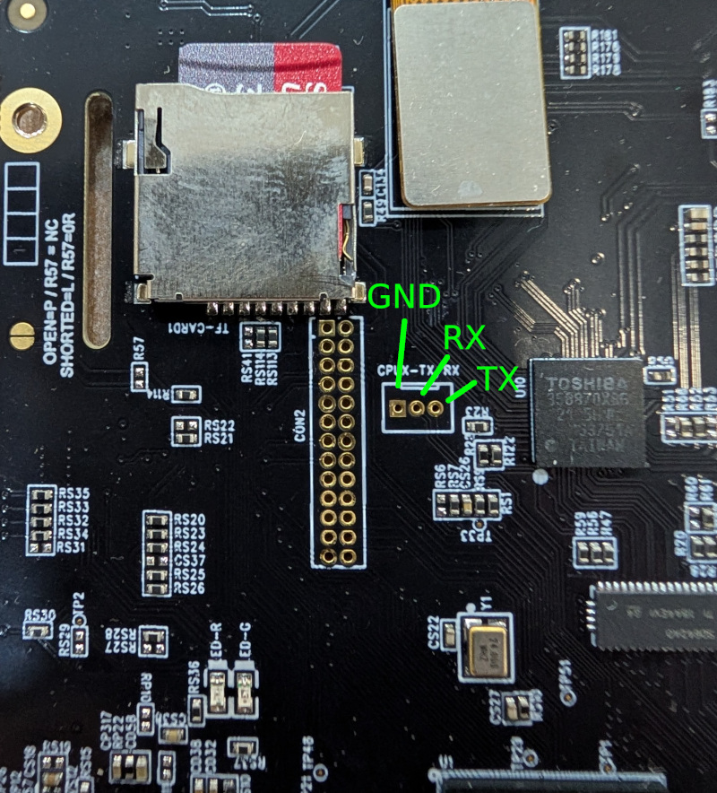

# lkg_go_buildroot_compliance_kit

# 📦 Compliance Source Package

This repository/archive contains the **Corresponding Source (CCS)** and the "scripts used to control compilation and installation" for the buildroot portion of the firmware used in the Looking Glass Go. 

This distribution is provided to satisfy the requirements of open-source licenses, specifically the **GNU General Public License (GPL)** and the **GNU Lesser General Public License (LGPL)**.

## ⚠️ Disclaimer

**This process is intended for advanced users.**
Modifying the firmware may result in a non-functional device. Looking Glass Factory provides these files to meet license obligations, but cannot offer technical support for custom firmware. Proceed at your own risk.

## 📂 Package Contents

The following structure is provided to ensure a fully reproducible build environment:

| Component | Path | Description |
| :--- | :--- | :--- |
| **Source Archives** | `sources/` | Compressed archives (`.tar.gz`, etc.) for all open-source components. |
| **Buildroot Patches** | `buildroot_patches/` | Custom patches applied to upstream buildroot. |
| **External Tree** | `buildroot_ext/` | The `BR2_EXTERNAL` tree containing board support and custom logic. |
| **License Report** | `license_report.html` | A human-readable manifest of all packages and their licenses. |
| **Build Configuration** | `configs/` | The specific `.config` file used for the system image excluding proprietary packages. |
| **Reconstruction Script**| `reconstruct.sh` | Automated script to set up the reproducible build environment. |
| **Raw Manifest** | `manifest.csv` | Machine-readable license data generated by Buildroot. |

---

## 🛠 Reconstruction Instructions

To reproduce the binaries, download the lkg_go_buildroot_compliance package from releases, you will need a Linux host system (Ubuntu 22.04 LTS).

### 1. Run the Automator Script
The included `reconstruct.sh` script automates the environment setup. It performs the following actions:
1.  **Dependency Check**: Verifies required host tools (gcc, make, rsync, git, etc.).
2.  **Environment Setup**: Clones the exact version of **Buildroot** used for this release via a specific Git Hash.
3.  **Offline Lockdown**: Configures Buildroot for **Strict Offline Mode**.
4.  **Path Linking**: Automatically maps `BR2_EXTERNAL`, and `BR2_DL_DIR` to the local bundled directories.

```bash
chmod +x reconstruct.sh
./reconstruct.sh
```
### 2. Start the Build
Once the script completes, navigate to the generated build directory and execute `make`:

```bash
cd output
make
```
### 3. Backup SD Card Image
We strongly recommend that you do not use the SD card that shipped with your Go. The factory SD card ships with device specific calibration data unique to each individual device. Whilst we do maintain a backup of this data, it will take a significant amount of time for us retrieve this for you.  

If you wish to backup your SD card, we recommend the following::
```
# Substitute 'X' as required
# Backup to local image
sudo dd bs=4M if=/dev/sdX | gzip > backup.img.gz
# Restore image to SD card
gunzip --stdout backup.img.gz | sudo dd bs=4M of=/dev/sdX conv=fsync
```
### 4. Flash SD Card Image
Once the build completes, you will find `sdcard.img.xz` inside `output/images`. You will need a SD card at least 32GB in size. This SD card image can be written using bmaptool. Substitute 'X' as required.
```
sudo umount /dev/sdX*
sudo bmaptool copy output/images/sdcard.img.xz /dev/sdX
```
### 5. Terminal Access
The compliance image will boot as far as the splash screen. The device will not display 3D images as this is handled by proprietary code that is not shipped within this package. To log into the system, connect a USB serial adapter to the pins marked CPUX-TX/RX. Use 115200kbps 8N1. The default user is 'lkg' and the password is 'nano'.

```
Welcome to Buildroot

With great power comes great responsibility!

buildroot login: lkg
Password: 
```
### 6. Test (kmscube)
The kmscube sample is included in the firmware, you need to execute this as the root user.
```
$ su -
Password: 
# kmscube
Using display 0xaaaac17c7e60 with EGL version 1.4
```


---

## ⚖️ Buildroot Compliance & Legal Info

This package was generated using the Buildroot `make legal-info` infrastructure, enhanced with custom auditing scripts to ensure 100% compliance while protecting proprietary assets.

### How this meets compliance:
* **Source Redistribution**: Buildroot extracts the exact source archives for every package used in the build into the `sources/` directory.
* **Scripts for Compilation**: The inclusion of the `.config`, the `BR2_EXTERNAL` tree, and the `buildroot_patches` folder fulfills the requirement to provide the "scripts used to control compilation."
* **Offline Reproducibility**: By pinning the Buildroot version to a specific **Git Hash** and enforcing `BR2_PRIMARY_SITE_ONLY=y`, we ensure the build is not dependent on external servers that may change or disappear.
* **License Manifest**: Buildroot generates the raw data, which we provide in both CSV and formatted HTML for auditing.

### 🛡 Proprietary Software Note
Internal proprietary components are identified in the `license_report.html` as **Proprietary**. In accordance with their respective licenses, the source code for these specific components is **not** included in the `sources/` directory.

---

